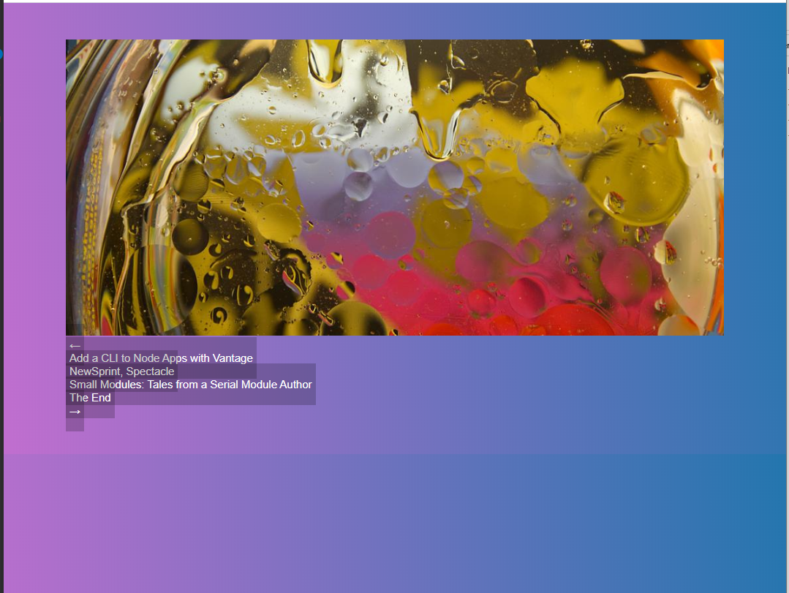
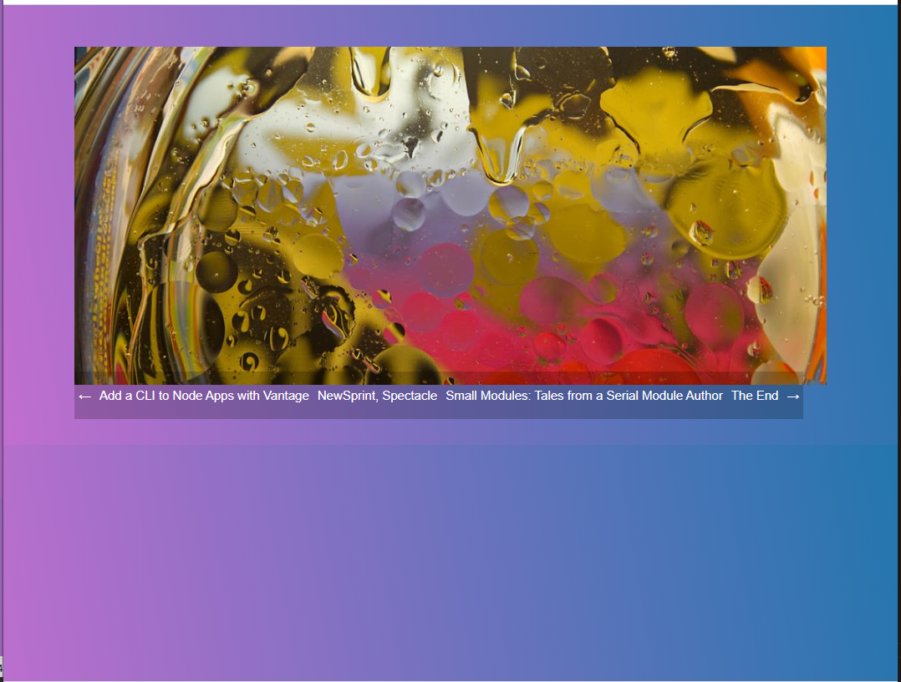
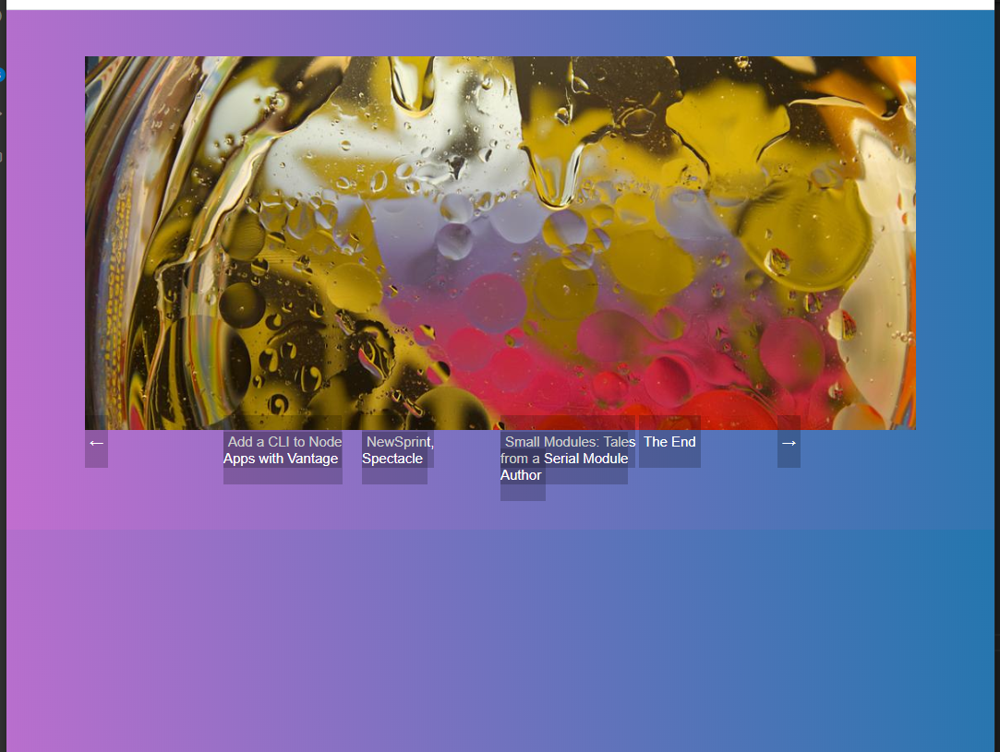
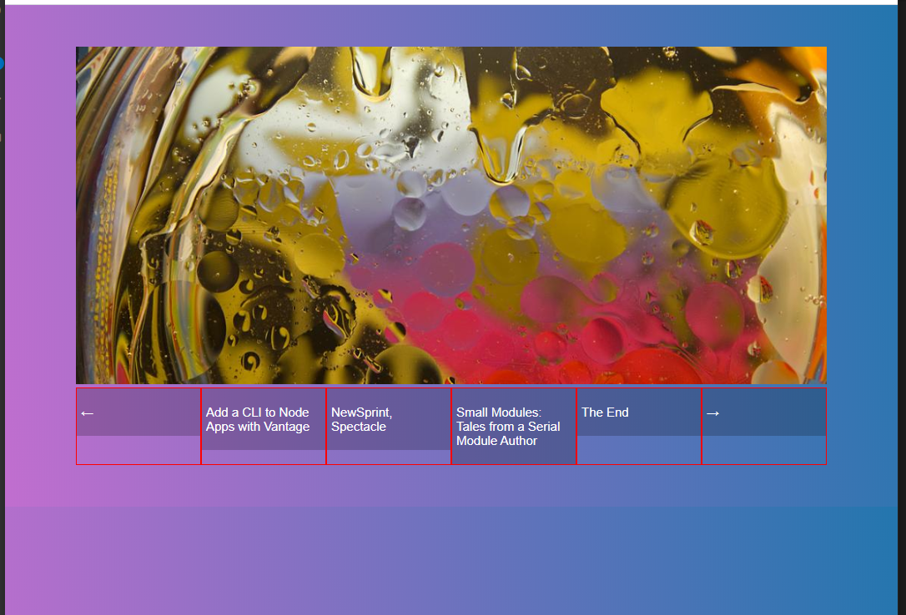
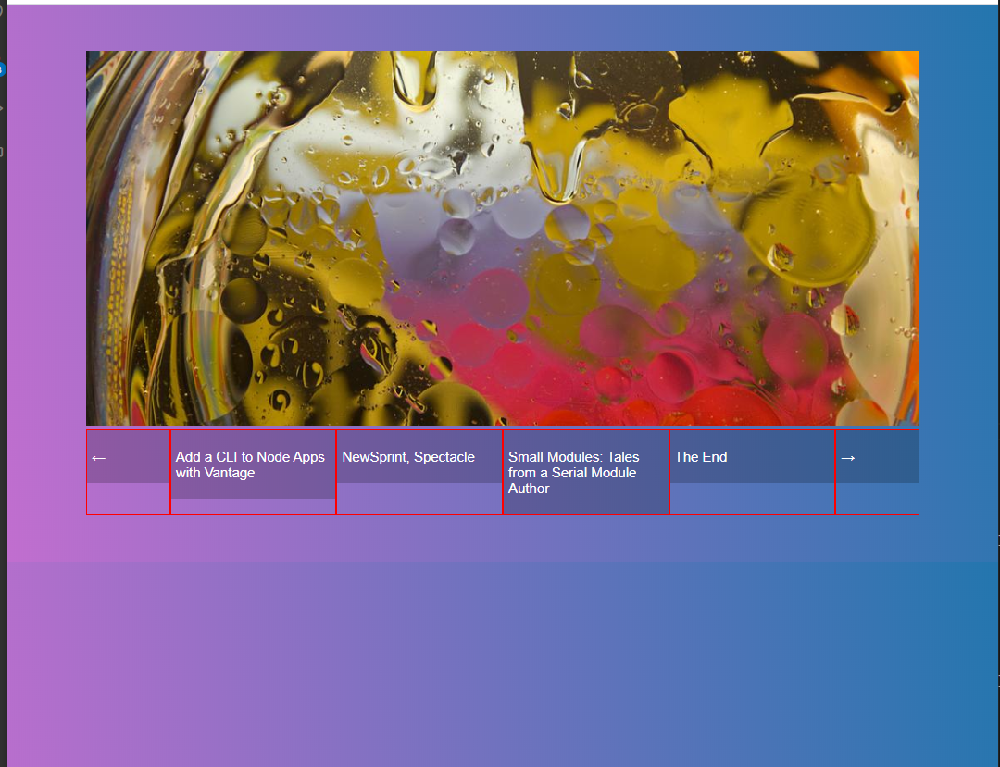
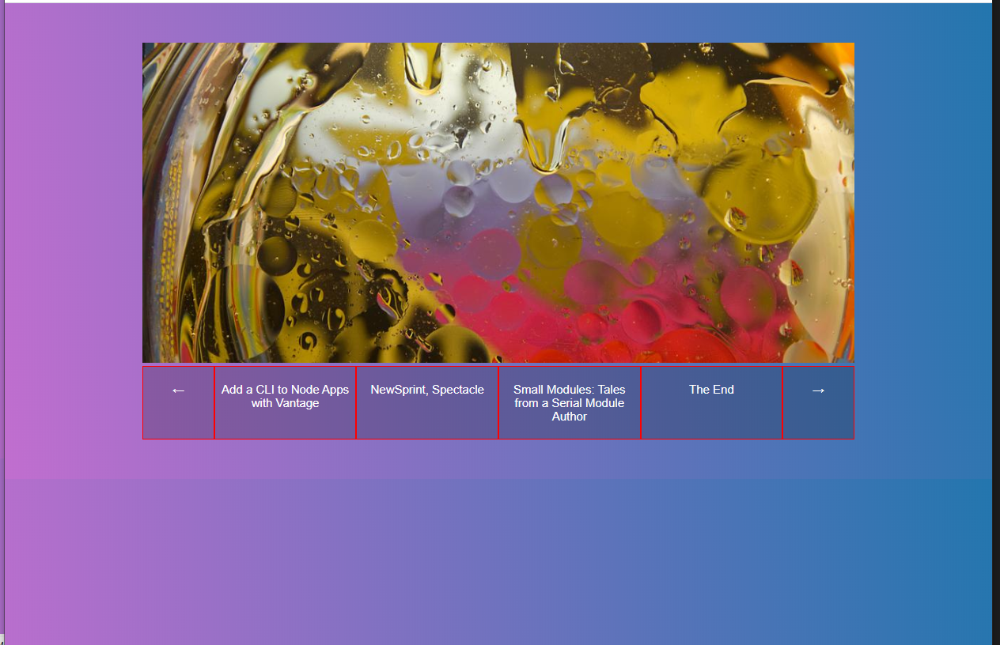
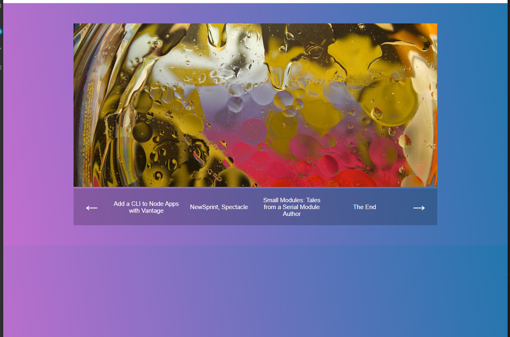

# Nesting flexbox for vertical and horizontal centering

## HTML used:
```
<!DOCTYPE html>
<html lang="en">
<head>
  <meta charset="UTF-8">
  <title>FlexBox Nav</title>
  <link rel="stylesheet" href="https://maxcdn.bootstrapcdn.com/font-awesome/4.3.0/css/font-awesome.min.css">
  <link rel="stylesheet" href="style.css">
</head>
<body>
  
  <div class="wrapper">
  
    <div class="slider">
      
    </div>

    <nav class="slider-nav">
      <ul>
        
        <li class="arrow">
          <a href="#">←</a>
        </li>
        
        <li>
          <a href="#">Add a CLI to Node Apps with Vantage</a>
        </li>
        
        <li>
          <a href="#">NewSprint, Spectacle</a>
        </li>
        
        <li>
          <a href="#">Small Modules: Tales from a Serial Module Author</a>
        </li>
        
        <li>
          <a href="#">The End</a>
        </li>
        
        <li class="arrow">
          <a href="#">→</a>
        </li>

      </ul>
    </nav>
  
  </div>
</body>
</html>
```

### init version

#### CSS
```
/* Some CSS Setup - nothing to do with flexbox */
html {
  box-sizing: border-box;
}

*, *:before, *:after {
  box-sizing: inherit;
}

body {
  font-family: sans-serif;
  margin: 0;
  background-image: linear-gradient(260deg, #2376ae 0%, #c16ecf 100%);
}

.wrapper {
  max-width: 1000px;
  margin: 0 auto;
  padding:50px;
}

img {
  max-width:100%;
}

a {
  color:white;
  text-decoration: none;
  font-size: 15px;
  background:rgba(0,0,0,0.2);
  padding:20px 5px;
}
a:hover {
  background:rgba(0,0,0,0.4);
}


.slider-nav ul {
  list-style: none;
  margin: 0;
  padding: 0; 
}
```


### made list items flex containers

#### CSS
```
html {
  box-sizing: border-box;
}

*, *:before, *:after {
  box-sizing: inherit;
}

body {
  font-family: sans-serif;
  margin: 0;
  background-image: linear-gradient(260deg, #2376ae 0%, #c16ecf 100%);
}

.wrapper {
  max-width: 1000px;
  margin: 0 auto;
  padding:50px;
}

img {
  max-width:100%;
}

a {
  color:white;
  text-decoration: none;
  font-size: 15px;
  background:rgba(0,0,0,0.2);
  padding:20px 5px;
}
a:hover {
  background:rgba(0,0,0,0.4);
}

.slider-nav ul {
  list-style: none;
  margin: 0;
  padding: 0;
  display: flex;
}
```


### added menu reordering and toggling

#### CSS
```
html {
  box-sizing: border-box;
}

*, *:before, *:after {
  box-sizing: inherit;
}

body {
  font-family: sans-serif;
  margin: 0;
  background-image: linear-gradient(260deg, #2376ae 0%, #c16ecf 100%);
}

.wrapper {
  max-width: 1000px;
  margin: 0 auto;
  padding:50px;
}

img {
  max-width:100%;
}

a {
  color:white;
  text-decoration: none;
  font-size: 15px;
  background:rgba(0,0,0,0.2);
  padding:20px 5px;
}
a:hover {
  background:rgba(0,0,0,0.4);
}

/* flex container */
.slider-nav ul {
  list-style: none;
  margin: 0;
  padding: 0;
  display: flex;
}

/* first flex item */
.slider-nav li {
  flex: 1;
}
```


### partial nav items fix

#### CSS
```
html {
  box-sizing: border-box;
}

*, *:before, *:after {
  box-sizing: inherit;
}

body {
  font-family: sans-serif;
  margin: 0;
  background-image: linear-gradient(260deg, #2376ae 0%, #c16ecf 100%);
}

.wrapper {
  max-width: 1000px;
  margin: 0 auto;
  padding:50px;
}

img {
  max-width:100%;
}

a {
  color:white;
  text-decoration: none;
  font-size: 15px;
  background:rgba(0,0,0,0.2);
  padding:20px 5px;
}
a:hover {
  background:rgba(0,0,0,0.4);
}

/* flex container */
.slider-nav ul {
  list-style: none;
  margin: 0;
  padding: 0;
  display: flex;
}

/* first flex item */
.slider-nav li {
  flex: 1;
  border: 1px solid red;
}

.slider-nav a {
  display: block;
  width: 100%;
}
```


### resized arrows

#### CSS
```
html {
  box-sizing: border-box;
}

*, *:before, *:after {
  box-sizing: inherit;
}

body {
  font-family: sans-serif;
  margin: 0;
  background-image: linear-gradient(260deg, #2376ae 0%, #c16ecf 100%);
}

.wrapper {
  max-width: 1000px;
  margin: 0 auto;
  padding:50px;
}

img {
  max-width:100%;
}

a {
  color:white;
  text-decoration: none;
  font-size: 15px;
  background:rgba(0,0,0,0.2);
  padding:20px 5px;
}
a:hover {
  background:rgba(0,0,0,0.4);
}

/* flex container */
.slider-nav ul {
  list-style: none;
  margin: 0;
  padding: 0;
  display: flex;
}

/* first flex item */
.slider-nav li {
  flex: 2;
  border: 1px solid red;
}

.slider-nav a {
  display: block;
  width: 100%;
}

.slider-nav .arrow {
  flex: 1;
}
```


### stretched nav items (still not centered)

#### CSS
```
html {
  box-sizing: border-box;
}

*, *:before, *:after {
  box-sizing: inherit;
}

body {
  font-family: sans-serif;
  margin: 0;
  background-image: linear-gradient(260deg, #2376ae 0%, #c16ecf 100%);
}

.wrapper {
  max-width: 1000px;
  margin: 0 auto;
  padding:50px;
}

img {
  max-width:100%;
}

a {
  color:white;
  text-decoration: none;
  font-size: 15px;
  background:rgba(0,0,0,0.2);
  padding:20px 5px;
}
a:hover {
  background:rgba(0,0,0,0.4);
}

/* flex container */
.slider-nav ul {
  list-style: none;
  margin: 0;
  padding: 0;
  display: flex;
}

/* first flex item */
.slider-nav li {
  /* flex-item properties */
  flex: 2;
  border: 1px solid red;
  text-align: center;
  /* flex container properties */
  display: flex;
}

/* flex items for .slider-nav li */
.slider-nav a {
  flex-basis: 100%;
}

.slider-nav .arrow {
  flex: 1;
}
```


### stretched nav items (still not centered)

### HTML

```
<!DOCTYPE html>
<html lang="en">
<head>
  <meta charset="UTF-8">
  <title>FlexBox Centering nested</title>
  <link rel="stylesheet" href="https://maxcdn.bootstrapcdn.com/font-awesome/4.3.0/css/font-awesome.min.css">
  <link rel="stylesheet" href="style.css">
</head>
<body>
  
  <div class="wrapper">
  
    <div class="slider">
      
    </div>

    <nav class="slider-nav">
      <ul>
        
        <li class="arrow">
          <a href="#"><span>←</span></a>
        </li>
        
        <li>
          <a href="#"><span>Add a CLI to Node Apps with Vantage</span></a>
        </li>
        
        <li>
          <a href="#"><span>NewSprint, Spectacle</span></a>
        </li>
        
        <li>
          <a href="#"><span>Small Modules: Tales from a Serial Module Author</span></a>
        </li>
        
        <li>
          <a href="#"><span>The End</span></a>
        </li>
        
        <li class="arrow">
          <a href="#"><span>→</span></a>
        </li>

      </ul>
    </nav>
  
  </div>
</body>
</html>
```

#### CSS
```
html {
  box-sizing: border-box;
}

*, *:before, *:after {
  box-sizing: inherit;
}

body {
  font-family: sans-serif;
  margin: 0;
  background-image: linear-gradient(260deg, #2376ae 0%, #c16ecf 100%);
}

.wrapper {
  max-width: 1000px;
  margin: 0 auto;
  padding:50px;
}

img {
  max-width:100%;
}

a {
  color:white;
  text-decoration: none;
  font-size: 15px;
  background:rgba(0,0,0,0.2);
  padding:20px 5px;
}
a:hover {
  background:rgba(0,0,0,0.4);
}

/* flex container */
.slider-nav ul {
  list-style: none;
  margin: 0;
  padding: 0;
  display: flex;
}

/* first flex item */
.slider-nav li {
  /* flex-item properties */
  flex: 2;
  text-align: center;
  /* flex container properties */
  display: flex;
}

/* flex items for .slider-nav li */
.slider-nav a {
  display: flex;
  flex-basis: 100%;
  align-items: center;
}

.arrow a {
  font-size: 30px;
}

.slider-nav .arrow {
  flex: 1;
}

.slider-nav span { /* flex-item */
  flex: 1;
  display: block;
  width: 100%;
}
```


