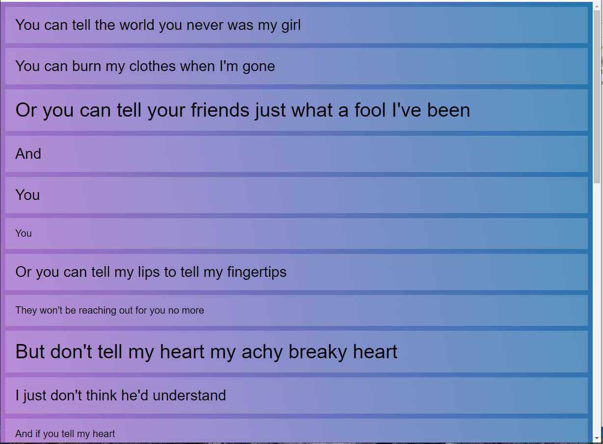
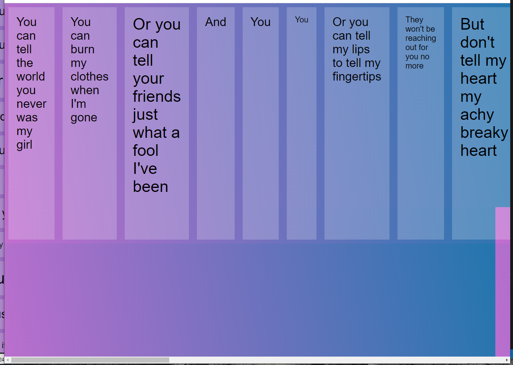
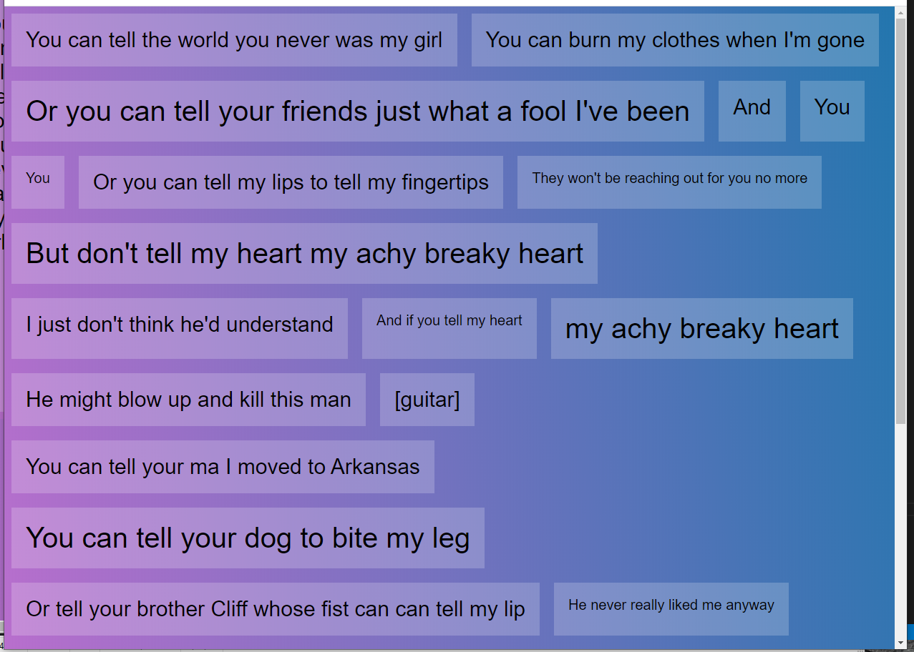
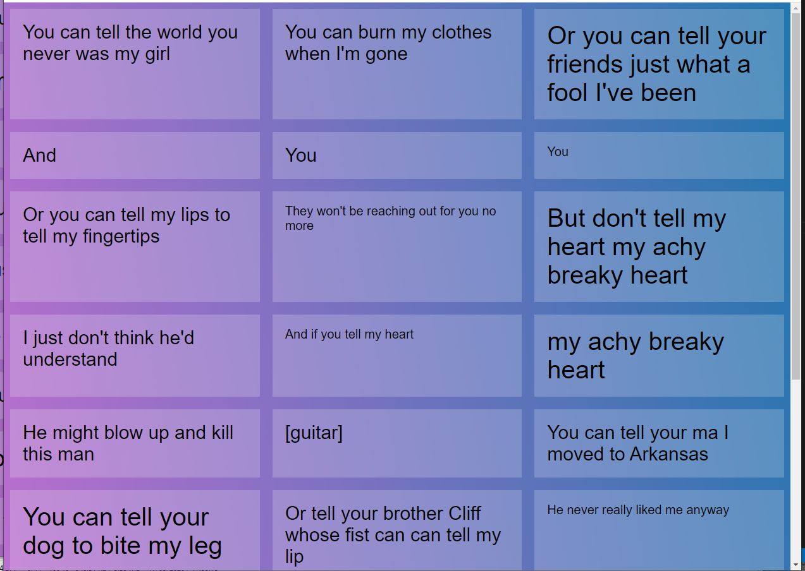
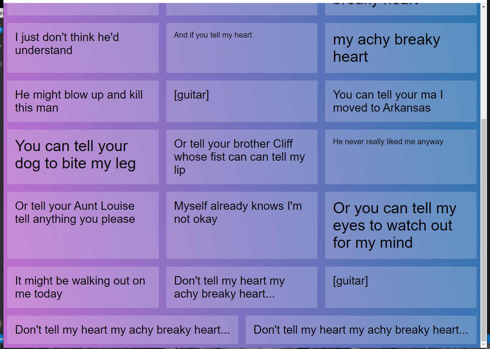
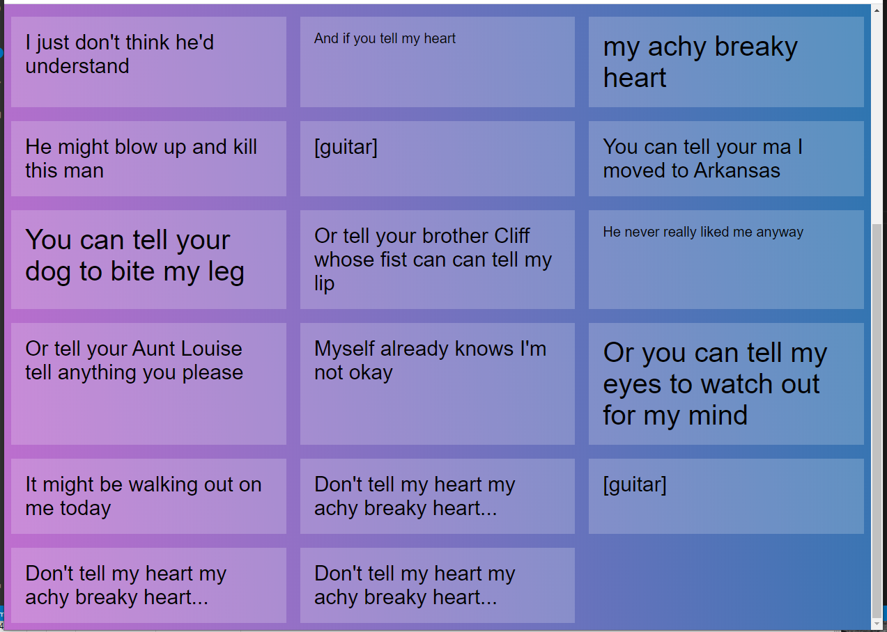
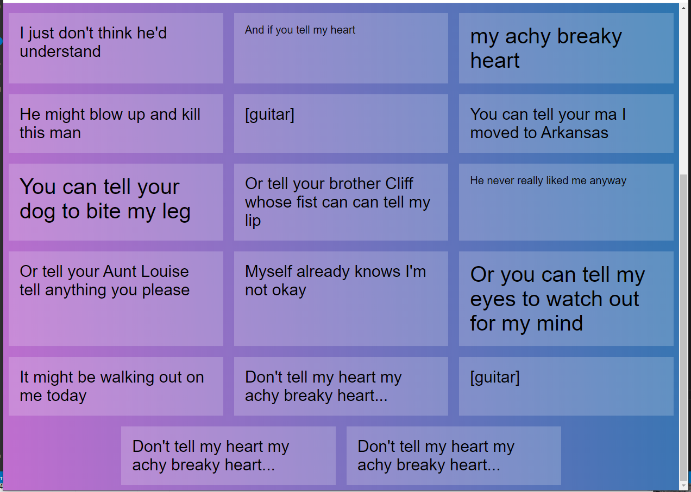

# Equal height columns and leftover elements

## HTML used:
```
<!DOCTYPE html>
<html lang="en">
<head>
  <meta charset="UTF-8">
  <title>FlexBox Nav</title>
  <link rel="stylesheet" href="https://maxcdn.bootstrapcdn.com/font-awesome/4.3.0/css/font-awesome.min.css">
  <link rel="stylesheet" href="style.css">
</head>
<body>

  <div class="elements">

    <div class="item">You can tell the world you never was my girl</div>
    <div class="item">You can burn my clothes when I'm gone</div>
    <div class="item large">Or you can tell your friends just what a fool I've been</div>
    <div class="item">And </div>

    <div class="item">You </div>
    <div class="item small">You </div>
    <div class="item">Or you can tell my lips to tell my fingertips</div>
    <div class="item small">They won't be reaching out for you no more</div>

    <div class="item large">But don't tell my heart my achy breaky heart</div>
    <div class="item">I just don't think he'd understand</div>
    <div class="item small">And if you tell my heart</div>
    <div class="item large">my achy breaky heart</div>
    <div class="item">He might blow up and kill this man</div>

    <div class="item">[guitar]</div>

    <div class="item">You can tell your ma I moved to Arkansas</div>
    <div class="item large">You can tell your dog to bite my leg</div>
    <div class="item">Or tell your brother Cliff whose fist can can tell my lip</div>
    <div class="item small">He never really liked me anyway</div>

    <div class="item">Or tell your Aunt Louise tell anything you please</div>
    <div class="item">Myself already knows I'm not okay</div>
    <div class="item large">Or you can tell my eyes to watch out for my mind</div>
    <div class="item">It might be walking out on me today</div>

    <div class="item">Don't tell my heart my achy breaky heart...</div>

    <div class="item">[guitar]</div>

    <div class="item">Don't tell my heart my achy breaky heart...</div>
    <div class="item">Don't tell my heart my achy breaky heart...</div>

  </div>

</body>
</html>
```

### init version

#### CSS
```
/* Some CSS Setup - nothing to do with flexbox */
html {
  box-sizing: border-box;
}

*, *:before, *:after {
  box-sizing: inherit;
}

body {
  font-family: sans-serif;
  margin: 0;
  background-image: linear-gradient(260deg, #2376ae 0%, #c16ecf 100%);
}

a {
  color:white;
}

.item.large {
  font-size: 40px;
}

.item.small {
  font-size: 20px;
}

.item {
  background:rgba(255,255,255,0.2);
  margin:10px;
  padding:20px;
  font-size: 30px;
}

/* Flexbox Starts Here: */
```


### added display: flex

#### CSS
```
/* Some CSS Setup - nothing to do with flexbox */
html {
  box-sizing: border-box;
}

*, *:before, *:after {
  box-sizing: inherit;
}

body {
  font-family: sans-serif;
  margin: 0;
  background-image: linear-gradient(260deg, #2376ae 0%, #c16ecf 100%);
}

a {
  color:white;
}

.item.large {
  font-size: 40px;
}

.item.small {
  font-size: 20px;
}

.item {
  background:rgba(255,255,255,0.2);
  margin:10px;
  padding:20px;
  font-size: 30px;
}

/* Flexbox Starts Here: */
.elements {
  display: flex;
}
```


### added wrapping

#### CSS
```
/* Some CSS Setup - nothing to do with flexbox */
html {
  box-sizing: border-box;
}

*, *:before, *:after {
  box-sizing: inherit;
}

body {
  font-family: sans-serif;
  margin: 0;
  background-image: linear-gradient(260deg, #2376ae 0%, #c16ecf 100%);
}

a {
  color:white;
}

.item.large {
  font-size: 40px;
}

.item.small {
  font-size: 20px;
}

.item {
  background:rgba(255,255,255,0.2);
  margin:10px;
  padding:20px;
  font-size: 30px;
}

/* Flexbox Starts Here: */
.elements {
  display: flex;
  flex-wrap: wrap;
}
```


### equal width columns

#### CSS
```
/* Some CSS Setup - nothing to do with flexbox */
html {
  box-sizing: border-box;
}

*, *:before, *:after {
  box-sizing: inherit;
}

body {
  font-family: sans-serif;
  margin: 0;
  background-image: linear-gradient(260deg, #2376ae 0%, #c16ecf 100%);
}

a {
  color:white;
}

.item.large {
  font-size: 40px;
}

.item.small {
  font-size: 20px;
}

.item {
  background:rgba(255,255,255,0.2);
  margin:10px;
  padding:20px;
  font-size: 30px;
}

/* Flexbox Starts Here: */
.elements {
  display: flex;
  flex-wrap: wrap;
}

.item {
  flex: 1 1 calc(33.333% - 20px);
}
```




### remove flex grow to not grow last two items

#### CSS
```
/* Some CSS Setup - nothing to do with flexbox */
html {
  box-sizing: border-box;
}

*, *:before, *:after {
  box-sizing: inherit;
}

body {
  font-family: sans-serif;
  margin: 0;
  background-image: linear-gradient(260deg, #2376ae 0%, #c16ecf 100%);
}

a {
  color:white;
}

.item.large {
  font-size: 40px;
}

.item.small {
  font-size: 20px;
}

.item {
  background:rgba(255,255,255,0.2);
  margin:10px;
  padding:20px;
  font-size: 30px;
}

/* Flexbox Starts Here: */
.elements {
  display: flex;
  flex-wrap: wrap;
}

.item {
  flex: 0 1 calc(33.333% - 20px);
}
```


### remove flex grow to not grow last two items

#### CSS
```
/* Some CSS Setup - nothing to do with flexbox */
html {
  box-sizing: border-box;
}

*, *:before, *:after {
  box-sizing: inherit;
}

body {
  font-family: sans-serif;
  margin: 0;
  background-image: linear-gradient(260deg, #2376ae 0%, #c16ecf 100%);
}

a {
  color:white;
}

.item.large {
  font-size: 40px;
}

.item.small {
  font-size: 20px;
}

.item {
  background:rgba(255,255,255,0.2);
  margin:10px;
  padding:20px;
  font-size: 30px;
}

/* Flexbox Starts Here: */
.elements {
  display: flex;
  flex-wrap: wrap;
  justify-content: center;
}

.item {
  flex: 0 1 calc(33.333% - 20px);
}
```


