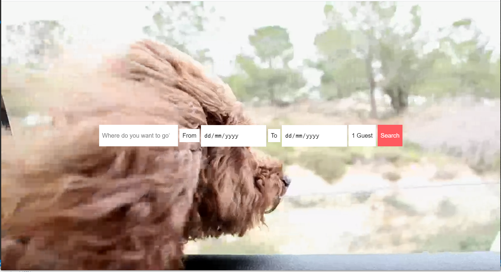
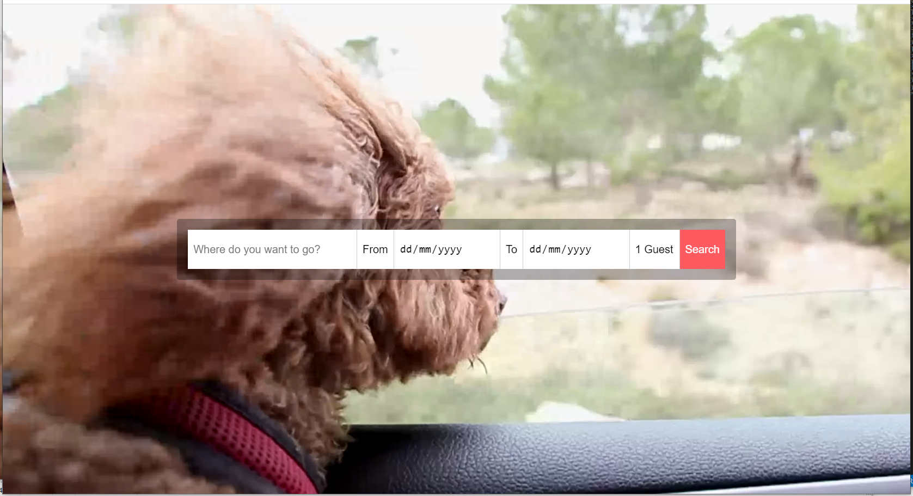

# Single line form

## HTML used:
```
<!DOCTYPE html>
<html lang="en">
<head>
  <meta charset="UTF-8">
  <title>FlexBox Nav</title>
  <link rel="stylesheet" href="https://maxcdn.bootstrapcdn.com/font-awesome/4.3.0/css/font-awesome.min.css">
  <link rel="stylesheet" href="style.css">
</head>
<body>


  <div class="cover">
    

    <form  class="flex-form">
      
      <input type="search" placeholder="Where do you want to go?">
      
      <label for="from">From</label>
      <input type="date" name="from">

      <label for="from">To</label>
      <input type="date" name="to">

      <select name="" id="">
        <option value="1">1 Guest</option>
        <option value="2">2 Guest</option>
        <option value="3">3 Guest</option>
        <option value="4">4 Guest</option>
        <option value="5">5 Guest</option>
      </select>

      <input type="submit" value="Search">

    </form>

  </div>
  
  <video  class="dog" src="Coverr-Lulu/Coverr-Lulu.webm" autoplay muted loop></video>

</body>
</html>
```

### init version

#### CSS
```
/* Some CSS Setup - nothing to do with flexbox */
html {
  box-sizing: border-box;
}

*, *:before, *:after {
  box-sizing: inherit;
}

body {
  font-family: sans-serif;
  margin: 0;
  overflow: hidden;
  background-image: linear-gradient(260deg, #2376ae 0%, #c16ecf 100%);
}

a {
  color:white;
}

.cover  {
  height:100vh;
  width:100%;
}

/*Video*/

.dog {
  height:100%;
  -webkit-filter:blur(5px);
  filter:blur(5px);
  position: absolute;
  top: 0;
  z-index: -1;
}

/*Hack to get them to align properly */
.flex-form > *:not([type="date"]) {
  border-top:1px solid white;
  border-bottom:1px solid white;
}

.flex-form input[type="submit"] {
  background:#FF5A5F;
  border-top: 1px solid #FF5A5F;
  border-bottom: 1px solid #FF5A5F;
  color:white;
}

.flex-form {
  z-index: 10;
  position: relative;
}

.flex-form > * {
  border:0;
  padding:10px;
  background:white;
  line-height:50px;
  font-size: 20px;
  border-radius:0;
  outline:0;
  border-right:1px solid rgba(0,0,0,0.2);
  -webkit-appearance:none;
}

.flex-form > *:last-child {
  border-right: 0;
}

/*Flexbox Starts Here*/
```


### Form centered and video stretched

#### CSS
```
/* Some CSS Setup - nothing to do with flexbox */
html {
  box-sizing: border-box;
}

*, *:before, *:after {
  box-sizing: inherit;
}

body {
  font-family: sans-serif;
  margin: 0;
  overflow: hidden;
  background-image: linear-gradient(260deg, #2376ae 0%, #c16ecf 100%);
}

a {
  color:white;
}

.cover  {
  height:100vh;
  width:100%;
}

/*Video*/

.dog {
  /* height:100%;
  -webkit-filter:blur(5px);
  filter:blur(5px); */
  position: absolute;
  top: 0;
  z-index: -1;
  object-fit: fill;
}

/*Hack to get them to align properly */
.flex-form > *:not([type="date"]) {
  border-top:1px solid white;
  border-bottom:1px solid white;
}

.flex-form input[type="submit"] {
  background:#FF5A5F;
  border-top: 1px solid #FF5A5F;
  border-bottom: 1px solid #FF5A5F;
  color:white;
}

.flex-form {
  z-index: 10;
  position: relative;
}

.flex-form > * {
  border:0;
  padding:10px;
  background:white;
  line-height:50px;
  font-size: 20px;
  border-radius:0;
  outline:0;
  border-right:1px solid rgba(0,0,0,0.2);
  -webkit-appearance:none;
}

.flex-form > *:last-child {
  border-right: 0;
}

/*Flexbox Starts Here*/
.cover {
  display: flex;
  justify-content: center; /* center horizontally on the main axis */
  align-items: center; /* center vertically on the cross axis */
}
```


### Form styles and resized

#### CSS
```
/* Some CSS Setup - nothing to do with flexbox */
html {
  box-sizing: border-box;
}

*, *:before, *:after {
  box-sizing: inherit;
}

body {
  font-family: sans-serif;
  margin: 0;
  overflow: hidden;
  background-image: linear-gradient(260deg, #2376ae 0%, #c16ecf 100%);
}

a {
  color:white;
}

.cover  {
  height:100vh;
  width:100%;
}

/*Video*/

.dog {
  /* height:100%;
  -webkit-filter:blur(5px);
  filter:blur(5px); */
  position: absolute;
  top: 0;
  z-index: -1;
  object-fit: fill;
}

/*Hack to get them to align properly */
.flex-form > *:not([type="date"]) {
  border-top:1px solid white;
  border-bottom:1px solid white;
}

.flex-form input[type="submit"] {
  background:#FF5A5F;
  border-top: 1px solid #FF5A5F;
  border-bottom: 1px solid #FF5A5F;
  color:white;
}

.flex-form {
  z-index: 10;
  position: relative;
}

.flex-form > * {
  border:0;
  padding:10px;
  background:white;
  line-height:50px;
  font-size: 20px;
  border-radius:0;
  outline:0;
  border-right:1px solid rgba(0,0,0,0.2);
  -webkit-appearance:none;
}

.flex-form > *:last-child {
  border-right: 0;
}

/*Flexbox Starts Here*/
.cover {
  display: flex;
  justify-content: center; /* center horizontally on the main axis */
  align-items: center; /* center vertically on the cross axis */
}

/* another flexbox container */
.flex-form {
  display: flex;
  border: 20px solid rgba(0,0,0,0.3);
  border-radius: 5px;
}

input[type="search"] {
  flex-basis: 350px;
}
```

